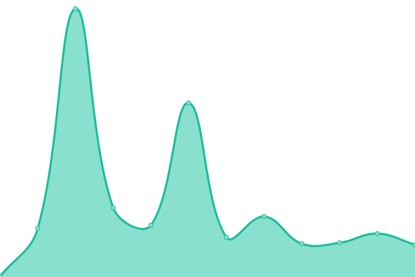

# [📈 Live Status](https://Ipapticsjbiain.github.io/EstadoDePaginas): <!--live status--> **🟧 Partial outage**

This repository contains the open-source uptime monitor and status page for [Ipapticsjbiain](https://Ipapticsjbiain.github.io/EstadoDePaginas), powered by [Upptime](https://github.com/upptime/upptime).

With [Upptime](https://upptime.js.org), you can get your own unlimited and free uptime monitor and status page, powered entirely by a GitHub repository. We use [Issues](https://github.com/Ipapticsjbiain/EstadoDePaginas/issues) as incident reports, [Actions](https://github.com/Ipapticsjbiain/EstadoDePaginas/actions) as uptime monitors, and [Pages](https://Ipapticsjbiain.github.io/EstadoDePaginas) for the status page.

<!--start: status pages-->
<!-- This summary is generated by Upptime (https://github.com/upptime/upptime) -->
<!-- Do not edit this manually, your changes will be overwritten -->
<!-- prettier-ignore -->
| URL | Status | History | Response Time | Uptime |
| --- | ------ | ------- | ------------- | ------ |
|  [Google](https://www.google.com) | 🟩 Up | [google.yml](https://github.com/Ipapticsjbiain/EstadoDePaginas/commits/HEAD/history/google.yml) | 

 117ms
     
 | 

<a href="https://Ipapticsjbiain.github.io/EstadoDePaginas/history/google">100.00%</a>
    

|  [IPAP Web](http://ipap.chaco.gov.ar) | 🟥 Down | [ipap-web.yml](https://github.com/Ipapticsjbiain/EstadoDePaginas/commits/HEAD/history/ipap-web.yml) | 

 5904ms
     
 | 

<a href="https://Ipapticsjbiain.github.io/EstadoDePaginas/history/ipap-web">99.83%</a>
    

|  [IPAP App](http://app.ipap.chaco.gov.ar/asistencias_beta) | 🟥 Down | [ipap-app.yml](https://github.com/Ipapticsjbiain/EstadoDePaginas/commits/HEAD/history/ipap-app.yml) | 

 6274ms
     
 | 

<a href="https://Ipapticsjbiain.github.io/EstadoDePaginas/history/ipap-app">0.00%</a>
    

|  [IPAP Certificados](http://certificados.ipap.chaco.gov.ar) | 🟩 Up | [ipap-certificados.yml](https://github.com/Ipapticsjbiain/EstadoDePaginas/commits/HEAD/history/ipap-certificados.yml) | 

 4438ms
     
 | 

<a href="https://Ipapticsjbiain.github.io/EstadoDePaginas/history/ipap-certificados">100.00%</a>
    

|  [IPAP Virtual](http://ipapvirtual.chaco.gov.ar) | 🟩 Up | [ipap-virtual.yml](https://github.com/Ipapticsjbiain/EstadoDePaginas/commits/HEAD/history/ipap-virtual.yml) | 

 5510ms
     
 | 

<a href="https://Ipapticsjbiain.github.io/EstadoDePaginas/history/ipap-virtual">100.00%</a>
    

|  [test4](https://www.google.com) | 🟩 Up | [test4.yml](https://github.com/Ipapticsjbiain/EstadoDePaginas/commits/HEAD/history/test4.yml) | 

 104ms
     
 | 

<a href="https://Ipapticsjbiain.github.io/EstadoDePaginas/history/test4">100.00%</a>
    

|  [test5](http://asdadsds.chaco.gov.ara) | 🟥 Down | [test5.yml](https://github.com/Ipapticsjbiain/EstadoDePaginas/commits/HEAD/history/test5.yml) | 

 0ms
     
 | 

<a href="https://Ipapticsjbiain.github.io/EstadoDePaginas/history/test5">100.00%</a>
    

<!--end: status pages-->

[**Visit our status website →**](https://Ipapticsjbiain.github.io/EstadoDePaginas)

## 📄 License

- Powered by: [Upptime](https://github.com/upptime/upptime)
- Code: [MIT](./LICENSE) © [Ipapticsjbiain](https://Ipapticsjbiain.github.io/EstadoDePaginas)
- Data in the `./history` directory: [Open Database License](https://opendatacommons.org/licenses/odbl/1-0/)
